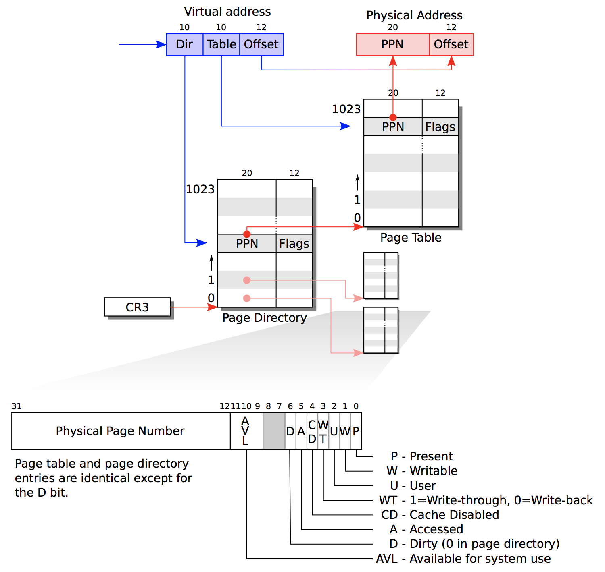

# annotated xv6

### memory management

这部分介绍xv6系统的内存管理，主要实现在`vm.c`文件中，但也用到了`mmu.h`，`kalloc.c`等源文件里的实现。

我们首先要清楚几个概念：

- 虚拟地址和物理地址实际上都是一块真实物理内存的别名。物理地址的命名空间是整个内核，虚拟地址的命名空间是一个进程。因此，通过虚拟地址和物理地址去操作内存里的数据，本质上没有区别。物理地址可用直接找到数据，而虚拟地址可以通过二级页表找到物理地址，从而也可以找到数据。
- 每一个进程都有一个二级页表，页表占用了1025个页：一个page directory占用了1页，包含1024个page directory entry，每个entry有32位（4个字节），通过entry中和虚拟地址的某些位可定位到page table的地址。一个page table占据1页，包含1024个page table entry，每个entry有32位（4个字节），通过entry和虚拟地址的某些位可用得到物理地址。二级页表只是一个地址转换的查找表，它只起一个地址翻译的作用。
- 进程启动时，由于进程访问整个地址空间都是合法的，二级页表中的1025个页应当已经分配好，但页表中具体的物理地址则是留空的，内核去不停地填写这张表，比如进程的各个数据段存放在某些物理地址的内存块中，而虚拟地址空间的布局是有规划的，内核就应该把数据真实存在的物理地址填写到定义好的虚拟地址上，即填写二级页表。
- 所以我们眼中的虚拟地址的保护是这样的：每一个进程都有一个二级页表，虚拟地址空间是相同的。填写这个二级页表，就是从freelist中找到一个可用的物理页然后映射给一个虚拟页。kalloc和kfree操作在内核中都是串行进行的，这样即使有很多进程同时做地址映射，也可以确保不同进程的虚拟页不会映射到同一块物理页上。
- 虚拟内存中，用户的地址空间和内核的地址空间是被KERNBASE截然分离的，然而实际的物理页却是混合在一起的。内核用了一种直观的方式将虚拟地址的KERNBASE～KERNBASE+PHYSTOP映射到物理地址0～PHYSTOP，并不是说内核用了全部这些内存。很显然用户的0～KERNBASE同样映射到物理地址0～PHYSTOP，但映射的方式由二级页表定义。直观映射给了内核一种直接操作的便捷。

接下来我们看具体的代码。

`mmu.h`中定义了一些与地址操作有关的宏：

```c
#define PDXSHIFT        22      // offset of PDX in a linear address
#define PDX(va)         (((uint)(va) >> PDXSHIFT) & 0x3FF)
```

PDX是将虚拟地址的最高10位取出来。

```c
#define PTXSHIFT        12      // offset of PTX in a linear address
#define PTX(va)         (((uint)(va) >> PTXSHIFT) & 0x3FF)
```

PTX是将虚拟地址的中间19位取出来。

```c
#define PGROUNDUP(sz)  (((sz)+PGSIZE-1) & ~(PGSIZE-1))
#define PGROUNDDOWN(a) (((a)) & ~(PGSIZE-1))
```

PGROUNDUP将一个字节数向上取整到页的整数倍，PGROUNDDOWN将一个地址向下对齐到页地址。

```c
// Page table/directory entry flags.
#define PTE_P           0x001   // Present
#define PTE_W           0x002   // Writeable
#define PTE_U           0x004   // User
#define PTE_PS          0x080   // Page Size
```

这些是PDE和PTE的最低12个字节中的标志位。

```c
#define PTE_ADDR(pte)   ((uint)(pte) & ~0xFFF)
```

PTE_ADDR取出一个PTE/PDE的高20个字节，并将低12个字节设置为0。这是一个PTE/PDE在相应表中的索引或地址。

```c
#define PTE_FLAGS(pte)  ((uint)(pte) &  0xFFF)
```

PTE_FLAGS取出一个PTE/PDE的低12个字节，这是一个PTE/PDE的标志位。

```c
typedef uint pte_t;
```

PTE的类型是一个无符号整数。

```c
#define V2P(a) (((uint) (a)) - KERNBASE)
#define P2V(a) ((void *)(((char *) (a)) + KERNBASE))
```

在介绍虚拟内存的操作之前，先了解内核分配内存的机制，这些定义在`kalloc.c`中。

```c
struct run { 
  struct run *next;
};

struct {
  struct spinlock lock;
  int use_lock;
  struct run *freelist;
} kmem;
```

run是一个单链表结构，每一个run实际上是指向下一个run的地址。对run进行sizeof操作实际上就是表示一个地址的字节数。run只是虚拟地址的链表。仔细想想这个看似矛盾的数据结构其实是非常合理的。

```c
void
kfree(char *v)
{
  struct run *r;
  if((uint)v % PGSIZE || v < end || V2P(v) >= PHYSTOP)
    panic("kfree");
  memset(v, 1, PGSIZE);
  if(kmem.use_lock)
    acquire(&kmem.lock);
  r = (struct run*)v;
  r->next = kmem.freelist;
  kmem.freelist = r;
  if(kmem.use_lock)
    release(&kmem.lock);
}
```

kfree只做了一件事，就是把以地址v开始的一页内存块加入到内核freelist中，也就是把地址v作为freelist的开头。我们并不需要关系从v开始的这页内存里的数据之前是什么。L11~12是把v这一页加到当前freelist的开头，先是让r的next指向旧的freelist开头，再让新的freelist指向r。这样就把一块充满了1的页内存加到了内核的freelist里。注意到freelist是一个链表，每个元素是下一个元素的地址，这个地址是一页的起始地址。freelist的一个元素并不是一页，而只是一个地址，但这个地址开始的4096个字节都是可用的内存块。

```c
void
freerange(void *vstart, void *vend)
{
  char *p;
  p = (char*)PGROUNDUP((uint)vstart);
  for(; p + PGSIZE <= (char*)vend; p += PGSIZE)
    kfree(p);
}
```

有了对kfree的理解，freerange就很简单了。内存释放和内存初始化这两个概念在某种意义上是相同的。对于释放或初始化vstart到vend这一块内存，只需找到这范围内的所有的页，然后一页页初始化就可以。

```c
char*
kalloc(void)
{
  struct run *r;
  if(kmem.use_lock)
    acquire(&kmem.lock);
  r = kmem.freelist;
  if(r)
    kmem.freelist = r->next;
  if(kmem.use_lock)
    release(&kmem.lock);
  return (char*)r;
}
```

kalloc分配一页4096个字节的物理内存，实际上非常简单，就是把freelist的第一个地址返回，也就是第一个可用页的起始地址，同时让freelist指向下一个可用页的起始地址。如果freelist是空指针，说明freelist用尽，就返回0 。

```c
static pte_t *
walkpgdir(pde_t *pgdir, const void *va, int alloc)
{
  pde_t *pde; 
  pte_t *pgtab;
  pde = &pgdir[PDX(va)]; 
  if(*pde & PTE_P){ 
    pgtab = (pte_t*)P2V(PTE_ADDR(*pde));
  } else {
    if(!alloc || (pgtab = (pte_t*)kalloc()) == 0)
      return 0;
    memset(pgtab, 0, PGSIZE);
    *pde = V2P(pgtab) | PTE_P | PTE_W | PTE_U;
  }
  return &pgtab[PTX(va)];
}
```

walkpgdir实际上做了两件事情：对于一个建立好的二级页表，每个虚拟地址都可以找到相应的page table entry（尽管entry里32位的数据不一定填写了），这是一个完整无缺的大厦。那么如果va是这个虚拟地址，就返回这个page table entry所在的地址；然而内核并不一定需要为每个进程都建立占用了1025个页的完整虚拟地址空间的二级页表，她可以采用更为高效率的方法：我只为我需要查询的虚拟地址建立二级页表，我在查询时如果这个va的page table不存在，就建立这个page table。当然不能只建立一个entry，因为分配内存最少也要分配一页。

从这个角度看，walkpgdir的实现非常自然：首先既然pgdir是一个函数参数，那么这一页一定是存在的，我们就可以找到page directory entry，然后根据entry的标志位判断地址va的page table是否存在，这是L6-7做的事情。如果page table是有的，那么这个地址在page table里就一定能找到page table entry，返回它的地址就行了。但如果page table不存在，则我们可以从内核的freelist中分配一页给这个page table，然后把这一页的地址填写到page directory entry中就行了。

进程的二级页表是内核的数据，因此存放在虚拟地址高于KERNBASE的空间中。结合下面这张图会看的比较清楚。



```c
static int
mappages(pde_t *pgdir, void *va, uint size, uint pa, int perm)
{
  char *a, *last;
  pte_t *pte;
  a = (char*)PGROUNDDOWN((uint)va);
  last = (char*)PGROUNDDOWN(((uint)va) + size - 1);
  for(;;){
    if((pte = walkpgdir(pgdir, a, 1)) == 0) 
      return -1;
    if(*pte & PTE_P) 
      panic("remap");
    *pte = pa | perm | PTE_P; 
    if(a == last)
      break;
    a += PGSIZE;
    pa += PGSIZE;
  }
  return 0;
}
```

正如我们之前所言，理想的情况是完整的二级页表已经建立好，而所有的page directory entry和page table entry留空，等待程序和数据的填写。实际的情况是，我们可以推迟建立二级页表，在填写物理地址和虚拟地址的映射时，再先建立相应的page directory entry和page table entry。mappages就做了这样一件事情：它将一个虚拟地址va开始的size长度的虚拟地址空间连续地映射到物理地址pa上。所以L9的walkpgdir就是找到或者创建page table entry，然后把物理地址pa和相应的标志位写到page table entry中即可。如果present bit已经设置，说明这个虚拟地址已经有其他的物理页了，这当然是错误的情况。

```c
static struct kmap {
  void *virt;
  uint phys_start;
  uint phys_end;
  int perm;
} kmap[] = {
 { (void*)KERNBASE, 0,             EXTMEM,    PTE_W}, // I/O space
 { (void*)KERNLINK, V2P(KERNLINK), V2P(data), 0},     // kern text+rodata
 { (void*)data,     V2P(data),     PHYSTOP,   PTE_W}, // kern data+memory
 { (void*)DEVSPACE, DEVSPACE,      0,         PTE_W}, // more devices
};
```

kmap定义了内核内存的布局。

```c
pde_t*
setupkvm(void)
{
  pde_t *pgdir;
  struct kmap *k;
  if((pgdir = (pde_t*)kalloc()) == 0)
    return 0;
  memset(pgdir, 0, PGSIZE);
  if (P2V(PHYSTOP) > (void*)DEVSPACE)
    panic("PHYSTOP too high");
  for(k = kmap; k < &kmap[NELEM(kmap)]; k++)
    if(mappages(pgdir, k->virt, k->phys_end - k->phys_start,
                (uint)k->phys_start, k->perm) < 0) {
      freevm(pgdir);
      return 0;
    }
  return pgdir;
}
```

setupkvm建立内核的虚拟地址空间。首先创建一个page directory，初始化4096个page directory entry的内存，然后按照kmap中四部分数据段的定义，创建这四段数据的全部page directory entry和page table entry。这个函数执行完后，kmap定义的四个数据段中的每个虚拟地址都可以通过两级页表找到物理地址。

```c
void
inituvm(pde_t *pgdir, char *init, uint sz)
{
  char *mem;
  if(sz >= PGSIZE)
    panic("inituvm: more than a page");
  mem = kalloc();
  memset(mem, 0, PGSIZE);
  mappages(pgdir, 0, PGSIZE, V2P(mem), PTE_W|PTE_U);
  memmove(mem, init, sz);
}
```

inituvm把从init地址开始、长度为sz的数据放在虚拟地址为0的页上。首先从可用的物理内存中分配一页，然后把这一页的物理地址映射到虚拟地址0，最后把实际的初始化段拷贝到之前分配的物理地址上。初始化段的长度sz必须不超过一页的长度。

```c
int
loaduvm(pde_t *pgdir, char *addr, struct inode *ip, uint offset, uint sz)
{
  uint i, pa, n;
  pte_t *pte;
  if((uint) addr % PGSIZE != 0)
    panic("loaduvm: addr must be page aligned");
  for(i = 0; i < sz; i += PGSIZE){
    if((pte = walkpgdir(pgdir, addr+i, 0)) == 0)
      panic("loaduvm: address should exist");
    pa = PTE_ADDR(*pte);
    if(sz - i < PGSIZE)
      n = sz - i;
    else
      n = PGSIZE;
    if(readi(ip, P2V(pa), offset+i, n) != n)
      return -1;
  }
  return 0;
}
```

loaduvm与文件系统有关，以后再说。

```c
int
allocuvm(pde_t *pgdir, uint oldsz, uint newsz)
{
  char *mem;
  uint a;
  if(newsz >= KERNBASE)
    return 0;
  if(newsz < oldsz)
    return oldsz;
  a = PGROUNDUP(oldsz);
  for(; a < newsz; a += PGSIZE){
    mem = kalloc();
    if(mem == 0){
      cprintf("allocuvm out of memory\n");
      deallocuvm(pgdir, newsz, oldsz);
      return 0;
    }
    memset(mem, 0, PGSIZE);
    if(mappages(pgdir, (char*)a, PGSIZE, V2P(mem), PTE_W|PTE_U) < 0){
      cprintf("allocuvm out of memory (2)\n");
      deallocuvm(pgdir, newsz, oldsz);
      kfree(mem);
      return 0;
    }
  }
  return newsz;
}
```

allocuvm和deallocuvm是为sbrk服务的，sbrk是进程增大或者缩小内存空间的系统调用。allocuvm是将进程的内存空间上限从oldsz提升到newsz，这里的sz实际上是地址。L8-12说如果newsz已经到了KERNBASE以上、或者newsz比oldsz小，都是错误的情况。后面真正干活的是L12-14, 20, 21这几行，做的事情是从oldsz上面一个对齐页开始，到newsz上面一个对齐页结束，给这些页分配新的物理页。

```c
int
deallocuvm(pde_t *pgdir, uint oldsz, uint newsz)
{
  pte_t *pte;
  uint a, pa;
  if(newsz >= oldsz)
    return oldsz;
  a = PGROUNDUP(newsz);
  for(; a  < oldsz; a += PGSIZE){
    pte = walkpgdir(pgdir, (char*)a, 0);
    if(!pte)
      a = PGADDR(PDX(a) + 1, 0, 0) - PGSIZE;
    else if((*pte & PTE_P) != 0){
      pa = PTE_ADDR(*pte);
      if(pa == 0)
        panic("kfree");
      char *v = P2V(pa);
      kfree(v);
      *pte = 0;
    }
  }
  return newsz;
}
```

deallocuvm与allocuvm的作用相反，是将进程的内存空间上限从oldsz降低到newsz。从newsz上面一个对齐页开始，到oldsz上面一个对齐页结束，首先找到每一页的page table entry，拿到物理地址pa，然后释放掉物理页加入到freelist中去，并且把page table entry清零。

```c
void
freevm(pde_t *pgdir)
{
  uint i;
  if(pgdir == 0)
    panic("freevm: no pgdir");
  deallocuvm(pgdir, KERNBASE, 0);
  for(i = 0; i < NPDENTRIES; i++){
    if(pgdir[i] & PTE_P){
      char * v = P2V(PTE_ADDR(pgdir[i]));
      kfree(v);
    }
  }
  kfree((char*)pgdir);
}
```

freevm释放掉一个进程的全部内存空间。L9将内存空间的上限从KERNBASE降低到0，这样用户内存页全部被释放。L10-13则根据内核内存布局释放掉内核内存页。

```c
void
clearpteu(pde_t *pgdir, char *uva)
{
  pte_t *pte;

  pte = walkpgdir(pgdir, uva, 0);
  if(pte == 0)
    panic("clearpteu");
  *pte &= ~PTE_U;
}
```

clearpteu这个简单，就是找到虚拟地址uva的page table entry然后把PTE_U这个标志位清除掉。

```c
pde_t*
copyuvm(pde_t *pgdir, uint sz)
{
  pde_t *d;
  pte_t *pte;
  uint pa, i, flags;
  char *mem;

  if((d = setupkvm()) == 0)
    return 0;
  for(i = 0; i < sz; i += PGSIZE){
    if((pte = walkpgdir(pgdir, (void *) i, 0)) == 0)
      panic("copyuvm: pte should exist");
    if(!(*pte & PTE_P))
      panic("copyuvm: page not present");
    pa = PTE_ADDR(*pte);
    flags = PTE_FLAGS(*pte);
    if((mem = kalloc()) == 0)
      goto bad;
    memmove(mem, (char*)P2V(pa), PGSIZE);
    if(mappages(d, (void*)i, PGSIZE, V2P(mem), flags) < 0) {
      kfree(mem);
      goto bad;
    }
  }
  return d;

bad:
  freevm(d);
  return 0;
}

```

copyuvm把父进程的page directory里从0到sz虚拟地址的所有page table拷贝给子进程。首先L11设置了内核的内存部分，返回建立好的page directory。然后虚拟地址从0开始，到sz结束，L14在父进程的page directory中找到虚拟地址的page table entry，L18-19取出物理地址和标志位，然后新分配一页，把父进程页表上物理页的数据拷贝到新分配的物理页，并在新建立的page directory中建立从同一个虚拟地址到新物理页的映射。

```c
char*
uva2ka(pde_t *pgdir, char *uva)
{
  pte_t *pte;

  pte = walkpgdir(pgdir, uva, 0);
  if((*pte & PTE_P) == 0)
    return 0;
  if((*pte & PTE_U) == 0)
    return 0;
  return (char*)P2V(PTE_ADDR(*pte));
}
```

我们之前提到过，用户虚拟内存空间的0～KERNBASE通过二级页表映射到物理内存的0～PHYSTOP，内核虚拟内存空间的KERNBASE～KERNBASE+PHYSTOP通过直接的P2V和V2P转换映射到物理内存的0～PHYSTOP；同时，由于分配内存的工作完全由内核控制，不会发生用户虚拟页和内核虚拟页映射到同一块物理页的情况。而uva2ka则进行了一种快捷的映射，对于一个用户虚拟地址uva，先找到它的物理地址pa，然后为内核提供一个虚拟地址，这个地址是内核访问pa的虚拟地址。

```c
int
copyout(pde_t *pgdir, uint va, void *p, uint len)
{
  char *buf, *pa0;
  uint n, va0;
  buf = (char*)p;
  while(len > 0){
    va0 = (uint)PGROUNDDOWN(va);
    pa0 = uva2ka(pgdir, (char*)va0);
    if(pa0 == 0)
      return -1;
    n = PGSIZE - (va - va0);
    if(n > len)
      n = len;
    memmove(pa0 + (va - va0), buf, n);
    len -= n;
    buf += n;
    va = va0 + PGSIZE;
  }
  return 0;
}
```

copyout将从物理地址p开始的len个字节拷贝到虚拟地址va，pgdir是某一个进程的page directory。va和p都不一定是页对齐的。va是用户的虚拟地址，但memmove需要的是内核的虚拟地址，因此L11首先找到包含va地址的用户页的首地址，然后L12找到内核页访问这个地址的虚拟地址，注意pa0是内核的虚拟地址。L18中memmove的目标地址是va对应的内核虚拟地址。

### Traps, interrupts, and drivers

需要看的几个源码文件：`trap.c`，`syscall.c`，`lapic.c`，`ide.c`。

```c
// Gate descriptors for interrupts and traps
struct gatedesc {
  uint off_15_0 : 16;   // low 16 bits of offset in segment
  uint cs : 16;         // code segment selector
  uint args : 5;        // # args, 0 for interrupt/trap gates
  uint rsv1 : 3;        // reserved(should be zero I guess)
  uint type : 4;        // type(STS_{IG32,TG32})
  uint s : 1;           // must be 0 (system)
  uint dpl : 2;         // descriptor(meaning new) privilege level
  uint p : 1;           // Present
  uint off_31_16 : 16;  // high bits of offset in segment
};
```

这里的结构体用了bit field（位域）的写法，冒号后面的数字表示这个字段占了多少位。

```c
// Set up a normal interrupt/trap gate descriptor.
// - istrap: 1 for a trap (= exception) gate, 0 for an interrupt gate.
//   interrupt gate clears FL_IF, trap gate leaves FL_IF alone
// - sel: Code segment selector for interrupt/trap handler
// - off: Offset in code segment for interrupt/trap handler
// - dpl: Descriptor Privilege Level -
//        the privilege level required for software to invoke
//        this interrupt/trap gate explicitly using an int instruction.
#define SETGATE(gate, istrap, sel, off, d)                \
{                                                         \
  (gate).off_15_0 = (uint)(off) & 0xffff;                 \
  (gate).cs = (sel);                                      \
  (gate).args = 0;                                        \
  (gate).rsv1 = 0;                                        \
  (gate).type = (istrap) ? STS_TG32 : STS_IG32;           \
  (gate).s = 0;                                           \
  (gate).dpl = (d);                                       \
  (gate).p = 1;                                           \
  (gate).off_31_16 = (uint)(off) >> 16;                   \
}
```

SETGATE宏提供了一种设置gate的相应字段的方法。我觉得s字段和off字段应当是interrupt/trap handler函数的地址。

```c
struct gatedesc idt[256];
extern uint vectors[];  // in vectors.S: array of 256 entry pointers
struct spinlock tickslock;
uint ticks;
void
tvinit(void)
{
  int i;
  for(i = 0; i < 256; i++)
    SETGATE(idt[i], 0, SEG_KCODE<<3, vectors[i], 0);
  SETGATE(idt[T_SYSCALL], 1, SEG_KCODE<<3, vectors[T_SYSCALL], DPL_USER);
  initlock(&tickslock, "time");
}
```

vectors设置了256个interrupt handler的code offset，由于是内核代码因此selector是SEG_KCODE，privilege是0，istrap是0。但是有一个特殊的interrupt叫做system call，它的privilege是DPL_USER级别的，因为这是用户代码唯一触发中断的方式。

```c
struct trapframe {
  // registers as pushed by pusha
  uint edi;
  uint esi;
  uint ebp;
  uint oesp;      // useless & ignored
  uint ebx;
  uint edx;
  uint ecx;
  uint eax;

  // rest of trap frame
  ushort gs;
  ushort padding1;
  ushort fs;
  ushort padding2;
  ushort es;
  ushort padding3;
  ushort ds;
  ushort padding4;
  uint trapno;

  // below here defined by x86 hardware
  uint err;
  uint eip;
  ushort cs;
  ushort padding5;
  uint eflags;

  // below here only when crossing rings, such as from user to kernel
  uint esp;
  ushort ss;
  ushort padding6;
};
```


```c
void
trap(struct trapframe *tf)
{
  if(tf->trapno == T_SYSCALL){
    if(myproc()->killed)
      exit();
    myproc()->tf = tf;
    syscall();
    if(myproc()->killed)
      exit();
    return;
  }

  switch(tf->trapno){
  case T_IRQ0 + IRQ_TIMER:
    if(cpuid() == 0){
      acquire(&tickslock);
      ticks++;
      wakeup(&ticks);
      release(&tickslock);
    }
    lapiceoi();
    break;
  case T_IRQ0 + IRQ_IDE:
    ideintr();
    lapiceoi();
    break;
  case T_IRQ0 + IRQ_IDE+1:
    // Bochs generates spurious IDE1 interrupts.
    break;
  case T_IRQ0 + IRQ_KBD:
    kbdintr();
    lapiceoi();
    break;
  case T_IRQ0 + IRQ_COM1:
    uartintr();
    lapiceoi();
    break;
  case T_IRQ0 + 7:
  case T_IRQ0 + IRQ_SPURIOUS:
    cprintf("cpu%d: spurious interrupt at %x:%x\n",
            cpuid(), tf->cs, tf->eip);
    lapiceoi();
    break;

  //PAGEBREAK: 13
  default:
    if(myproc() == 0 || (tf->cs&3) == 0){
      // In kernel, it must be our mistake.
      cprintf("unexpected trap %d from cpu %d eip %x (cr2=0x%x)\n",
              tf->trapno, cpuid(), tf->eip, rcr2());
      panic("trap");
    }
    // In user space, assume process misbehaved.
    cprintf("pid %d %s: trap %d err %d on cpu %d "
            "eip 0x%x addr 0x%x--kill proc\n",
            myproc()->pid, myproc()->name, tf->trapno,
            tf->err, cpuid(), tf->eip, rcr2());
    myproc()->killed = 1;
  }

  // Force process exit if it has been killed and is in user space.
  // (If it is still executing in the kernel, let it keep running
  // until it gets to the regular system call return.)
  if(myproc() && myproc()->killed && (tf->cs&3) == DPL_USER)
    exit();

  // Force process to give up CPU on clock tick.
  // If interrupts were on while locks held, would need to check nlock.
  if(myproc() && myproc()->state == RUNNING &&
     tf->trapno == T_IRQ0+IRQ_TIMER)
    yield();

  // Check if the process has been killed since we yielded
  if(myproc() && myproc()->killed && (tf->cs&3) == DPL_USER)
    exit();
}
```

